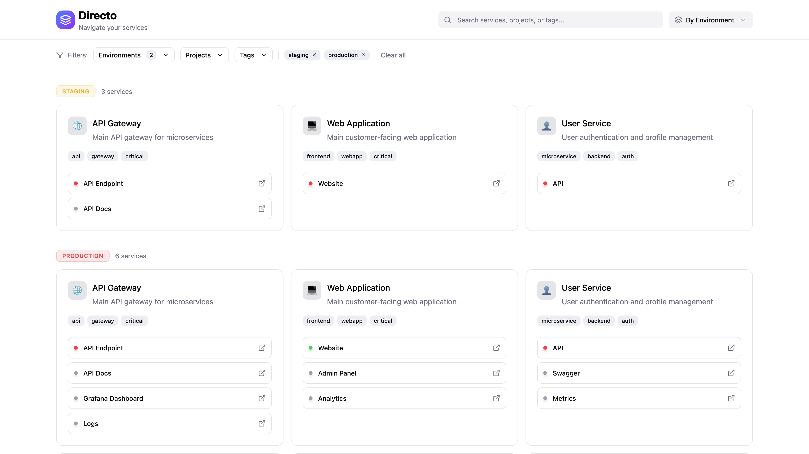

# Directo

[](https://github.com/ismailperim/directo/actions/workflows/docker-publish.yml)
[](https://github.com/ismailperim/directo/stargazers)
[](https://github.com/ismailperim/directo/issues)
[](https://github.com/ismailperim/directo/blob/main/LICENSE)
[](https://github.com/ismailperim/directo/pkgs/container/directo)

**Your central dashboard for all service links.**

Directo organizes your services, environments, and operational links in one place. No more bookmark chaos - just a clean, YAML-configured dashboard with health checks and flexible grouping.



## Features

- 📋 **YAML Configuration** - Single source of truth in Git
- 🎯 **Smart Grouping** - View by environment, project, or team
- 💚 **Real-Time Health Checks** - HTTP health checks with caching (TTL: 5min)
- 🔍 **Powerful Filtering** - Search + filter by environment, project, tags
- 💾 **Persistent Filters** - Client-side localStorage saves your preferences
- 🎨 **Modern UI** - React + Tailwind CSS with dark mode support
- 🌈 **Emoji Icons** - Visual service identification
- 🐳 **Docker Ready** - Production-ready multi-stage build

## Use Cases

- **Service Discovery**: All your Swagger docs, dashboards, and tools in one place
- **Incident Response**: Quick access to Grafana, Kibana, K8s dashboards when seconds count
- **Onboarding**: New team members see all relevant links immediately
- **Multi-Environment**: Switch between prod/uat/dev views instantly
- **Link Maintenance**: Automated health checks catch dead/stale links before your team wastes time clicking 6-year-old Confluence URLs

## Why Directo?

**The Problem**: You find a Confluence page with "helpful" links. Half are 404s. The Grafana dashboard moved. The API docs are outdated. You waste 15 minutes hunting for the right URL.

**The Solution**: Directo health checks validate every link automatically. Dead links are flagged instantly. Your team always has working, up-to-date links.

## Quick Start

### Using Docker (Recommended)

```bash
# Pull from GitHub Container Registry
docker pull ghcr.io/ismailperim/directo:latest

# Run with default config
docker run -p 3000:3000 ghcr.io/ismailperim/directo:latest

# Or run with custom config
docker run -p 3000:3000 \
  -v $(pwd)/services.yml:/app/backend/services.yml \
  ghcr.io/ismailperim/directo:latest
```

### Using Docker Compose

```bash
# Clone the repository
git clone https://github.com/ismailperim/directo.git
cd directo

# Start the service
docker-compose up -d
```

### Local Development

```bash
# Clone the repository
git clone https://github.com/ismailperim/directo.git
cd directo

# Install all dependencies (root + backend + frontend)
npm run install:all

# Optional: Configure environment
cp backend/.env.example backend/.env

# The included services.yml has working examples - try it first!
# Then customize with your own services

# Run in development mode (starts both backend + frontend)
npm run dev
```

**Development URLs:**
- **Frontend (React UI)**: http://localhost:5173 (Vite dev server with hot reload)
- **Backend (API)**: http://localhost:3000 (Express API server)

**Production Build:**
```bash
# Build everything (backend + frontend)
npm run build

# Start production server (serves frontend + API from single port)
npm start
```

Open http://localhost:3000 in production mode (or http://localhost:5173 in dev mode) and explore the example services!

## Architecture

Directo is a **React + Express monolith** with clean separation:

```
directo/
├── backend/          # Express API server (TypeScript)
│   ├── src/
│   │   ├── api/      # REST endpoints
│   │   ├── core/     # Config loader, health checker
│   │   └── utils/    # Service normalizer, logger
│   └── services.yml  # YAML service configuration
├── frontend/         # React UI (TypeScript + Vite)
│   └── src/
│       ├── app/      # App component + views
│       └── api/      # API client for backend
└── Dockerfile        # Multi-stage build (frontend + backend)
```

**Components:**

1. **YAML Config Loader** (backend) - Parses service definitions
2. **Service Normalizer** (backend) - Transforms nested structure to flat UI format
3. **Health Check Engine** (backend) - Monitors service availability
4. **REST API** (backend) - `/api/services` endpoints
5. **React Dashboard** (frontend) - Modern UI with filters, search, view modes
6. **Vite Build** (frontend) - Optimized production bundle served by Express

## Configuration

See [docs/configuration.md](docs/configuration.md) for detailed setup instructions.

## Development

```bash
# Install dependencies
npm install

# Run tests
npm test

# Build
npm run build

# Run in development mode
npm run dev
```

## Contributing

Contributions are welcome! Please read [CONTRIBUTING.md](CONTRIBUTING.md) before submitting PRs.

## License

MIT License - see [LICENSE](LICENSE) for details.

## Roadmap

- [x] YAML config parser
- [x] Health check engine (server-side HTTP checks)
- [x] Environment/project/team view modes
- [x] Client preferences (localStorage filter persistence)
- [x] Dark mode support
- [x] Search and filtering (environment, project, tags)
- [x] React + TypeScript frontend
- [x] Multi-stage Docker build
- [ ] Client-side health checks (CORS-friendly)
- [ ] Prometheus/Grafana integration for health status
- [ ] Health check alerting/notifications
- [ ] Service favorites/pinning
- [ ] Custom grouping via YAML
- [ ] LDAP/SSO authentication
- [ ] Multi-tenancy support

---

**Status**: Production Ready ✅

Built with Node.js, TypeScript, and Docker.
